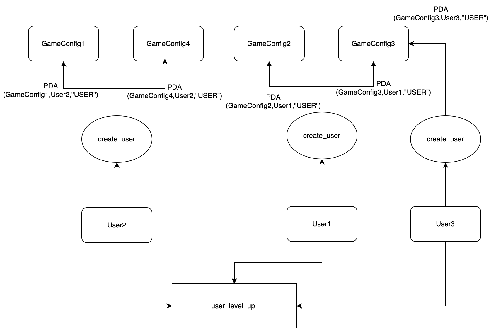
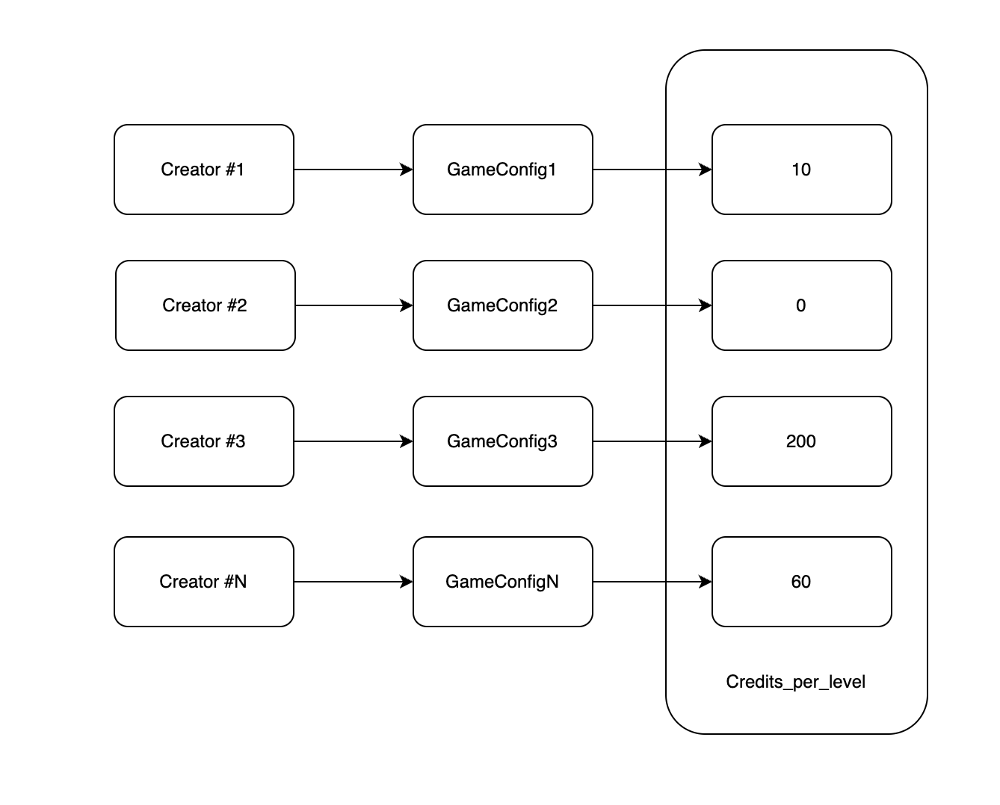

> **Note:** Instructions on running the POCs in this repo can be found [here](./INSTALL.md).

## 🚀 High-level System Overview
This document provides the core design and functionalities of the Solana program and describes how different participants interact with it. It offers a summary of the program’s features, including account creation, credit minting, and user interaction.

1. Game Configuration Creation 
Any user (or designated admin) starts by calling the `create_game_config` function. In this step, a Game Configuration PDA is derived and initialized with a specific `credits_per_level` value. This configuration sets the parameters for how credits are converted into in-game progress.
2. User Account Initialization
A user then creates a User PDA by invoking the `create_user` function. This operation uses the chosen Game Configuration PDA to bind the user’s account to that specific game economy, allowing them to take further actions in the game.
3. Credit Minting
The creator of the Game Configuration PDA mints credits to the User PDA using the `mint_credits_to_user` function. These credits represent the in-game currency that the user will later spend to level up.
4. Leveling Up
When a user wishes to progress, they call the `user_level_up` function. This function calculates the required credits for the next level based on the `credits_per_level` set in the Game Configuration PDA and burns the necessary amount from the User PDA balance. If the user has sufficient credits, their level is incremented accordingly.

> **Note:** As illustrated in the diagram, a single user can create multiple User PDAs linked to different Game Configurations. Each configuration operates independently, allowing users to participate in various “game economies” simultaneously.

## 🔒 System Assumptions
After reviewing the system’s design and underlying game-theoretic principles, key assumptions were developed on the basis of which the issues have been identified.

**Decentralized Configuration**
Any user who holds a valid Solana account (i.e., a public/private keypair capable of signing transactions) is authorized to create a `Game Configuration PDA`. This PDA can be initialized with any desired value for `credits_per_level`. In this multi-economy game:
   - If there are N creators (e.g., creators1, creators2, …, creatorsN), each creators can independently create their own game configuration account. For example, creators1 can create `game_config1` with `credits_per_level` set to `n1`, creators2 can create `game_config2` with `credits_per_level` set to `n2`, and so on. The system design allows for multiple, creators-specific game configurations, meaning that the game parameters (such as the cost of leveling up, as determined by `credits_per_level`) can vary between different creatorss.
   - Since any creator can create their own `Game Configuration PDA` with their chosen `credits_per_level`, the idea of a single creator/owner initializing a global configuration is `NOT assumed to be an issue` for this system.
  

**Configuration Isolation** 
Each game configuration is independent. A user's in-game activity i.e `create_user` & `user_level_up`  must rely solely on the configuration they initially selected, and no other configuration can influence or alter their state.
